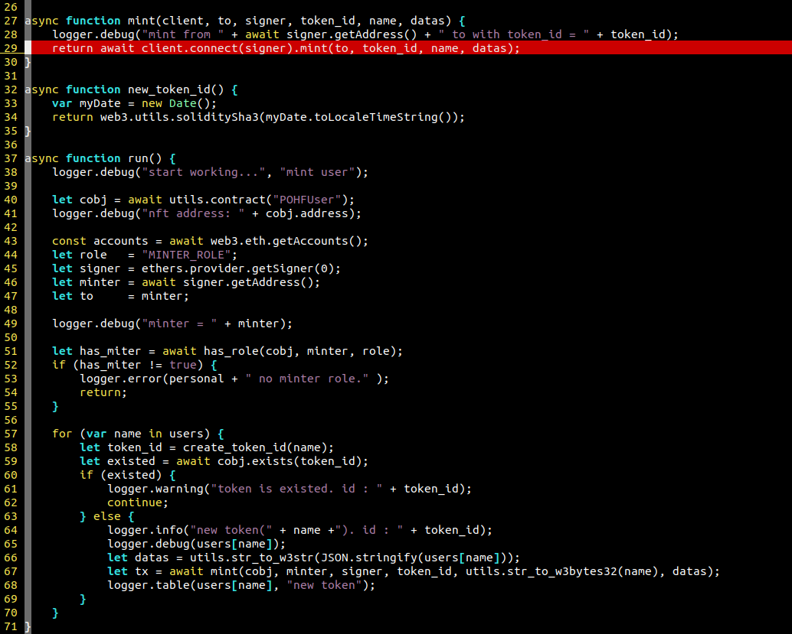
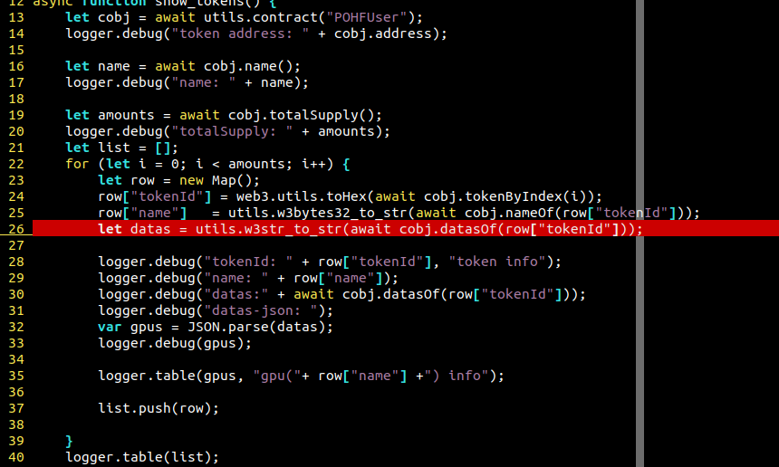

# CONTENT

**Note**: 合约接口说明

## Overview

接口中用到了 [JSON](https://www.json.org/json-en.html) 格式.

## Version

v2.0.0

## JSON 
JSON (JavaScript Object Notation) is a lightweight data-interchange format, It is easy for humans to read and write. It is easy for machines to parse and generate. Refer to the [JSON](https://www.json.org/json-en.html)

## 合约地址
参照[合约地址](./contract_internal.md)列表文件

---

### mint

**Description**

创建新的通证


#### Attributes


<table>
 <tr>
  <td><strong>Name</strong></td>
  <td><strong>Type</strong></td>
  <td><strong>Value</strong></td>
  <td><strong>Description</strong></td>
 </tr>
 <tr>
  <td><strong>to</strong></td>
  <td>string(hex)</td>
  <td>address:hex-str(len = 32)</td>
  <td>通证拥有者地址</td>
 </tr>
 <tr>
  <td><strong>tokenId</strong></td>
  <td>BigInt</td>
  <td>number</td>
  <td>token id, 唯一</td>
 </tr>
 <tr>
  <td><strong>name</strong></td>
  <td>string</td>
  <td>name1/task1/model1</td>
  <td>token对应的名称，长度32字节以内</td>
 </tr>
 <tr>
  <td><strong>datas</strong></td>
  <td>string</td>
  <td>string(hex(stringif(json)))</td>
  <td>证书描述内容，json格式序列化后转为十六进制的形式在链上存储</td>
 </tr>
</table>

```
'mint("0xE90FEE0C8a65F8EC1Aa695e694A4733cAf67Ae46", "0xa5ee730d7001c3f9910d10959b8c33255eccd28779a3c2368db3651747f2aa0c", "alice", "0x0000000000000000000000000000000000000000000000000000000000000020000000000000000000000000000000000000000000000000000000000000003f7b226e616d65223a22426f62222c226d6f62696c65223a223139393939393939393939222c2261646472657373223a2278787820787878782078787878227d00")'
```


### datasOf

**Description**

获取指定token的证书内容


#### Attributes


<table>
 <tr>
  <td><strong>Name</strong></td>
  <td><strong>Type</strong></td>
  <td><strong>Value</strong></td>
  <td><strong>Description</strong></td>
 </tr>
 <tr>
 <tr>
  <td><strong>tokenId</strong></td>
  <td>BigInt</td>
  <td>number</td>
  <td>token id, 目标id</td>
 </tr>
</table>

```
'datasOf("0xa5ee730d7001c3f9910d10959b8c33255eccd28779a3c2368db3651747f2aa0c")'
```


